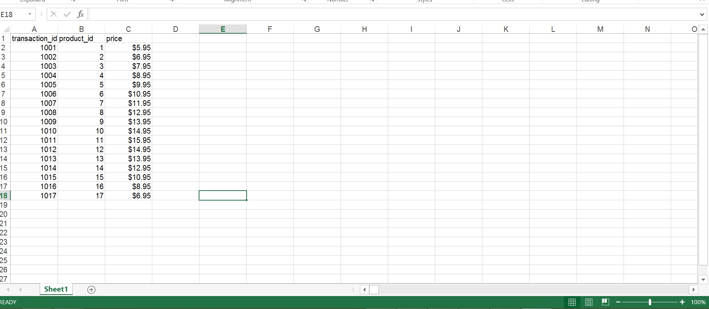
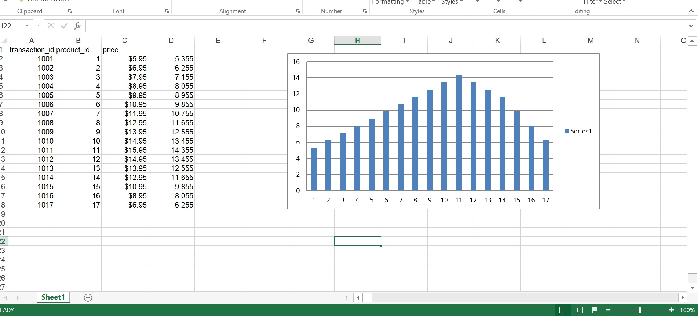

A simple project showing the example of how automation can be done using python.

Input file:

Output file:

I have used the openpyxl library in this project.
Here a simple example is shown which is used for printing the corrected values in another column.
The app.py has a function which takes 2 parameters - input file name and the output filename.
A graph is also generated in this excel sheet.
You can see the input and output files named as 'transactions.xlsx' and 'transactions2.xlsx' respectively.